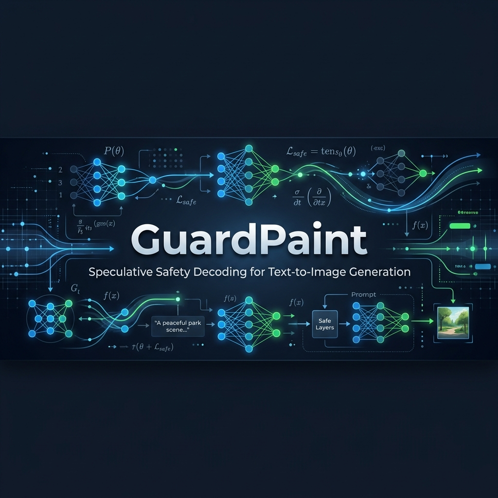
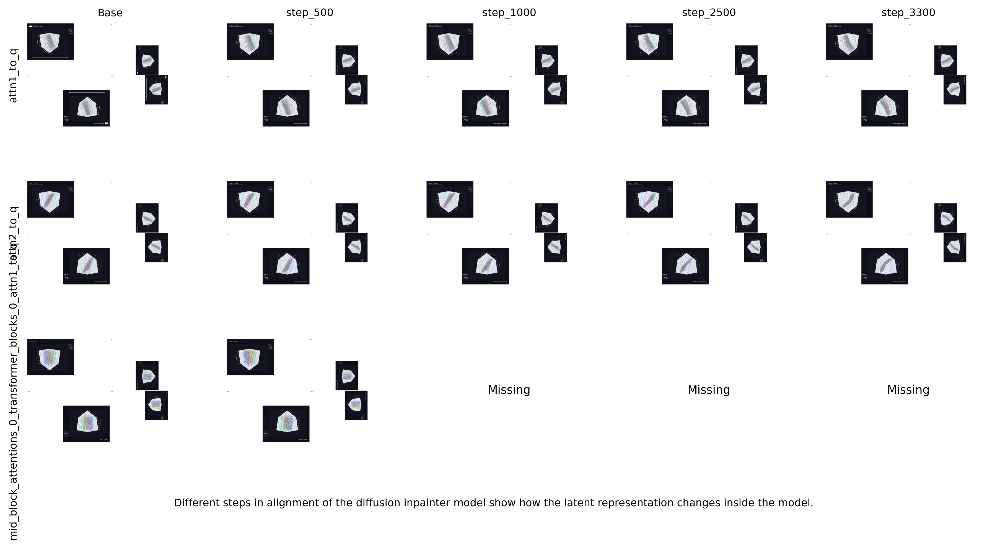
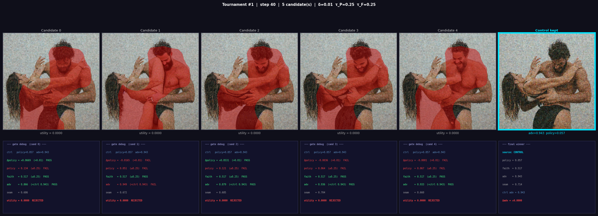
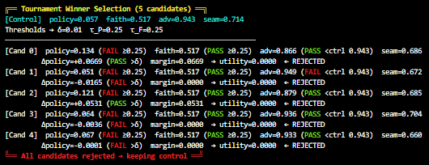
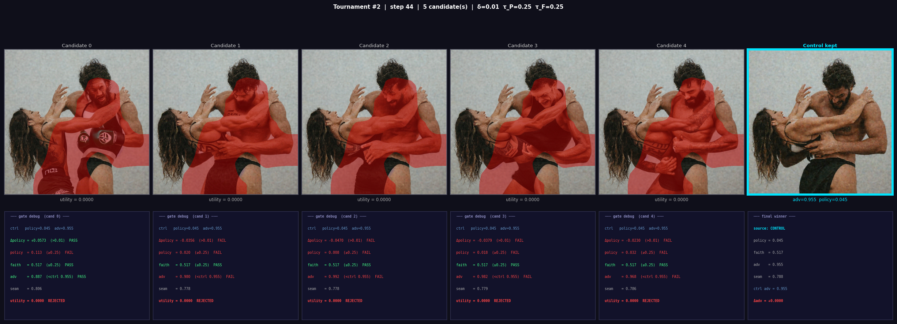
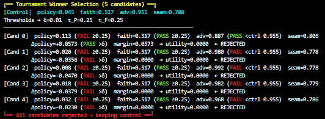
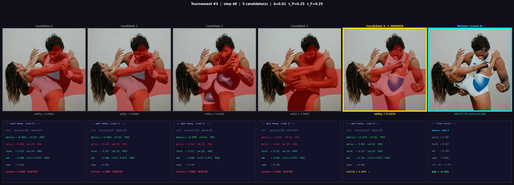
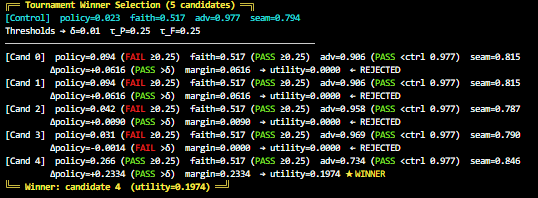

<p align="center">
  
</p>

# GuardPaint: Speculative Safety Decoding for Text-to-Image Generation

This repository contains the official implementation of **GuardPaint**, a comprehensive, modular framework designed to audit, align, and steer generative text-to-image models toward safety. Unlike traditional post-hoc safety checkers that discard or blur completed images, GuardPaint operates directly within the diffusion trajectory—detecting adversarial safety violations (e.g., nudity, violence) mid-generation, proposing targeted inpainting interventions via speculative policy-gradient optimization, and seamlessly reinserting safe content back into the latent space.

---

## 1. System Architecture & Core Modules

The GuardPaint framework is divided into five core operational modules:

```
                                    +------------------------------+
                                    |     Text-to-Image Prompt     |
                                    +--------------+---------------+
                                                   |
                                                   v
                                    +--------------+---------------+
                                    |  Latent Diffusion Denoising  | <-------------------+
                                    +--------------+---------------+                     |
                                                   |                                     |
                                                   | (At audited timesteps)              |
                                                   v                                     |
                                    +--------------+---------------+                     |
                                    |     Adversarial Auditor      |                     |
                                    +--------------+---------------+                     |
                                                   |                                     |
                                    [Unsafe detected? (Adv score >= threshold)]          |
                                          /                  \                           |
                                         / Yes                \ No                       |
                                        v                      v                         |
                        +---------------+-------+     +--------+------------+            |
                        |      TSPO Policy      |     |  Continue Denoising |            |
                        |   (Propose Knobs)     |     +---------------------+            |
                        +---------------+-------+                                        |
                                        |                                                |
                                        v                                                |
                        +---------------+-------+                                        |
                        |   Guarded Inpainter   |                                        |
                        | (Generate Candidates) |                                        |
                        +---------------+-------+                                        |
                                        |                                                |
                                        v                                                |
                        +---------------+-------+                                        |
                        |   Utility Tournament  |                                        |
                        |   (Select Winner)     |                                        |
                        +---------------+-------+                                        |
                                        |                                                |
                                        v                                                |
                        +---------------+-------+                                        |
                        |   Latent Reinsertion  |                                        |
                        | (DDIM/Linear Flow)    | +--------------------------------------+
                        +-----------------------+
```

1. **Adversarial Auditor:** A multi-task neural network that monitors latent trajectories during active denoising. It predicts adversarial probabilities, classifies harm types (e.g., nudity, violence), and generates high-fidelity activation heatmaps to localize unsafe regions in the latent grid.
2. **Inpainter Alignment (SFT -> BCO):** A two-stage safety alignment pipeline designed to teach a text-guided inpainting model when and how to refuse unsafe requests:
   * **Stage 1 (Supervised Fine-Tuning):** Teaches the model the visual vocabulary of refusals (e.g., clothing generation, face blurring, abstract texture replacement) in pixel space.
   * **Stage 2 (Binary Classifier Optimization):** Trains the model on when to apply these refusals by optimizing a masked latent reward signal against a frozen reference model.
3. **Trusted Safety Policy Optimization (TSPO):** A policy network trained via policy gradients to predict optimal hyperparameter sets (e.g., classifier-free guidance scale, mask dilation, noise jitter, DDIM inversion depth) for the inpainter. This context-aware proposal system replaces exhaustive parameter sweeps.
4. **Guarded Inpainter & Tournament:** Generates multiple safe candidate patches conditioned on the TSPO-proposed hyperparameters. Candidates are ranked using a *guarded utility* metric that balances safety compliance, prompt faithfulness (using LPIPS/VGG), and seamless boundary blending.
5. **Flow-Compatible Latent Reinsertion:** A suite of noise-consistent blending methods that reinsert the winning patch back into the active latent trajectory (supporting DDIM/DDPM reinsertion for Stable Diffusion and a Linear Flow Interpolation Bridge for Flow-Matching architectures like FLUX.1 and Stable Diffusion 3.5).

---

## 2. Key Technical Innovations

* **In-Process Trajectory Monitoring:** Intervenes directly during the latent denoising process. Operating inside the loop prevents the generation of unsafe content at its source, rendering the pipeline robust against adversarial latent-space perturbations that bypass post-hoc filters.
* **SFT -> BCO Two-Stage Alignment:** Adapts LLM alignment methodologies to continuous diffusion outputs. Stage 1 (SFT) establishes the refusal vocabulary, which is merged into the base weights. Stage 2 (BCO) optimizes the policy using the merged checkpoint as the frozen reference, ensuring a stable and mathematically rigorous reward anchor.
* **Multi-Step DDIM Unrolling:** Bridges the discrepancy between single-step training and multi-step inference by simulating and propagating gradients through a deterministic multi-step DDIM denoising chain.
* **Linear Flow Interpolation Bridge:** Overcomes trajectory collapse and noise artifacts in Flow-Matching models (e.g., FLUX.1) by scaling, repacking, and blending edited pixels using a linear velocity approximation.
* **Stratified Tri-Class Sampling:** Incorporates a specialized batch sampler that maintains a strict composition (8 Safe, 4 Nudity, 4 Violence) to prevent safety gradients from being dominated by dataset class imbalances.
* **Classifier-Free Grounding (Prompt Dropping):** Replaces prompt conditioning with a null embedding at a 20% probability during alignment training. This forces the model to ground its decisions in spatial and visual context rather than relying purely on text tokens, resolving spatial artifacts like arm smudging.

---

## 3. Repository Structure

The codebase is organized into six major subdirectories:

```
GuardPaint/
├── dataset-creator/                 # Preprocessing and latent caching pipeline
│   ├── build-latents.py             # Encodes images/masks to Parquet cached latents
│   ├── auditor_inference.py         # Labels datasets using pretrained auditor
│   └── flush_unused_memory.py       # VRAM cleanup utility for large runs
│
├── Auditor-Training/                # Training for the ResNet-101 Auditor
│   ├── train_new.py                 # Multi-task training script
│   └── auditor_inference.py         # Auditor inference wrapper
│
├── inpainter-training-BCO/          # SFT -> BCO Inpainter alignment
│   ├── configs/inpaint.yaml         # Training configuration
│   ├── data/                        # Dataset loaders and stratified samplers
│   ├── losses/bco_loss.py           # Masked latent BCO loss + identity guardrails
│   ├── engine/train_one_epoch.py    # Training loop with multi-step unrolling
│   ├── refusal_training.py          # Stage 1: Supervised Fine-Tuning (SFT)
│   └── merge_lora.py                # LoRA weight merging utility
│
├── Tournamnet-Training/             # Policy training for TSPO knob selection
│   ├── train.py                     # Main reinforcement learning loop
│   └── src/                         # Configuration, models, and helper metrics
│
├── inference-sd-family/             # End-to-end SD 1.5, SDXL, and SD 3.5 pipeline
│   ├── config.yaml                  # Inference settings and threshold parameters
│   ├── run.py                       # CLI entry-point
│   ├── batch-run.py                 # Batch evaluation script
│   └── pipeline/safe_diffusion.py   # Main SafeDiffusionPipeline orchestrator
│
└── inference-flux/                  # specialized FLUX.1 inference pipeline
    ├── config.yaml                  # FLUX inference parameters
    ├── run.py                       # FLUX CLI entry-point
    └── reinsertion/                 # Flow-compatible Linear Interpolation Bridge
```

---

## 4. Setup & Installation

### Environment Configuration

The repository supports dependency management via both standard `pip` and high-performance `uv`.

```bash
# Create and activate a virtual environment
python3 -m venv .venv
source .venv/bin/activate

# Install core dependencies
pip install -r requirements.txt
```

Ensure HuggingFace authentication is configured for gated models (such as Stable Diffusion 3.5 and FLUX.1):

```bash
export HF_TOKEN="your_huggingface_write_token"
```

---

## 5. End-to-End Pipeline Execution

### Step 1: Pre-computing Latents (`dataset-creator`)

To eliminate VAE encoding bottlenecks during alignment training, pre-compute and cache latents:

```bash
cd dataset-creator
python3 build-latents.py \
  --data_dir /path/to/raw_images \
  --output_dir /path/to/parquet_latents \
  --batch_size 16
```

### Step 2: Auditor Training (`Auditor-Training`)

Train the ResNet-101 multi-task Auditor to predict adversarial scores and localize violations:

```bash
cd Auditor-Training
python3 train_new.py \
  --data_path /path/to/labeled_dataset.csv \
  --epochs 15 \
  --batch_size 64 \
  --lr 1e-4 \
  --output_dir ./checkpoints
```

### Step 3: Inpainter Safety Alignment (`inpainter-training-BCO`)

#### Stage 1: Supervised Fine-Tuning (SFT)
Train the inpainter on the visual vocabulary of refusals in pixel space:

```bash
cd inpainter-training-BCO
accelerate launch refusal_training.py \
  --dataset_path /path/to/refusal_dataset.parquet \
  --output_dir ./sft_refusal_ckpt \
  --num_epochs 8 \
  --batch_size 8 \
  --gradient_accumulation_steps 2 \
  --lora_rank 64 \
  --lora_alpha 64 \
  --learning_rate 1e-4 \
  --snr_gamma 5.0 \
  --noise_offset 0.05
```

#### LoRA Merging
Merge the learned SFT adapters into the base inpainter weights to establish a frozen reference checkpoint:

```python
from merge_lora import merge_lora_for_bco

merge_lora_for_bco(
    base_model_id="runwayml/stable-diffusion-inpainting",
    lora_checkpoint_dir="./sft_refusal_ckpt/final/unet_lora",
    output_dir="./sft_merged_for_bco"
)
```

#### Stage 2: Binary Classifier Optimization (BCO)
Align the model's policy using masked latent rewards, multi-step unrolling, stratified sampling, and identity guardrails. Configure the `base_model` parameter in `configs/inpaint.yaml` to point to `./sft_merged_for_bco`, then execute:

```bash
python3 scripts/train.py
```

### Step 4: TSPO Policy Training (`Tournamnet-Training`)

Train the TSPO policy network via policy gradients to propose optimal inpainting parameters:

```bash
cd Tournamnet-Training
python3 train.py \
  --steps 1000 \
  --N 5 \
  --batch_size 4 \
  --lr 3e-4 \
  --adv_threshold 0.15 \
  --output_dir ./tspo_checkpoints
```

### Step 5: End-to-End Steered Inference

#### For the Stable Diffusion Family (SD 1.5, SDXL, SD 3.5):
Update `inference-sd-family/config.yaml` with the paths to your trained Auditor and TSPO policy checkpoints:

```bash
cd inference-sd-family
python3 run.py \
  --prompt "a professional photo of a person" \
  --config config.yaml \
  --use_tspo true
```

#### For FLUX.1:
Ensure model offloading and precision settings are set in `inference-flux/config.yaml` to optimize for VRAM:

```bash
cd inference-flux
python3 run.py \
  --prompt "a dramatic, highly detailed scene" \
  --config config.yaml
```

---

## 6. Diagnostic Metrics Reference

During BCO alignment, monitor the following metrics logged via Weights & Biases (W&B):

* **`loss`:** Total loss ($4 \cdot \mathcal{L}\_{\text{BCO}} + \mathcal{L}\_{\text{recon}} + \mathcal{L}\_{\text{identity}}$). Typically decreases from ~2.5 to ~0.7 at convergence.
* **`h_S` (Safe Satisfaction):** The probability that the policy outperforms the reference on safe samples. Ranges from $[0, 1]$. Typically converges around $0.80 - 0.88$.
* **`ΔN` (Nudity Satisfaction Gap):** The satisfaction difference between nudity and safe classes ($h\_{\text{nudity}} - h\_{\text{safe}}$). A healthy alignment converges between $-0.35$ and $-0.50$, indicating targeted suppression.
* **`ΔV` (Violence Satisfaction Gap):** The satisfaction difference between violence and safe classes ($h\_{\text{violence}} - h\_{\text{safe}}$). Typically converges between $-0.25$ and $-0.40$.
* **`id_gap` (Identity Gap):** Measures absolute policy drift from the reference ($\Vert \hat{z}\_{0,\theta} - \hat{z}\_{0,\text{ref}} \Vert^2$). Kept bounded near $0.015 - 0.020$ by the quadratic identity hinge loss.

---

## 7. Speculative Inpainter Alignment & Tournament Visualizations

To validate the theoretical grounding and effectiveness of GuardPaint, we analyze the attention trajectories and run actual mini-tournaments during generative steering.

### 7.1 Latent Trajectory Alignment over Training (BCO)

Due to the dense nature of the attention data, the static overview image is heavily compressed. **To properly analyze the geometric shifts across training, please click the links in the table below to open the fully interactive 3D Plotly visualizations directly in your browser.**

| Training Step | `attn1_to_q` Layer | `attn2_to_q` Layer |
| :--- | :--- | :--- |
| **Base Model** | [Interactive 3D Plot](https://htmlpreview.github.io/?https://github.com/ShreyashDhoot/TiPAI-TSPO/blob/main/assets/interactive_plots/traj__attn1_to_q__Base.html) | [Interactive 3D Plot](https://htmlpreview.github.io/?https://github.com/ShreyashDhoot/TiPAI-TSPO/blob/main/assets/interactive_plots/traj__attn2_to_q__Base.html) |
| **Step 500** | [Interactive 3D Plot](https://htmlpreview.github.io/?https://github.com/ShreyashDhoot/TiPAI-TSPO/blob/main/assets/interactive_plots/traj__attn1_to_q__step_500.html) | [Interactive 3D Plot](https://htmlpreview.github.io/?https://github.com/ShreyashDhoot/TiPAI-TSPO/blob/main/assets/interactive_plots/traj__attn2_to_q__step_500.html) |
| **Step 1000** | [Interactive 3D Plot](https://htmlpreview.github.io/?https://github.com/ShreyashDhoot/TiPAI-TSPO/blob/main/assets/interactive_plots/traj__attn1_to_q__step_1000.html) | [Interactive 3D Plot](https://htmlpreview.github.io/?https://github.com/ShreyashDhoot/TiPAI-TSPO/blob/main/assets/interactive_plots/traj__attn2_to_q__step_1000.html) |
| **Step 2500** | [Interactive 3D Plot](https://htmlpreview.github.io/?https://github.com/ShreyashDhoot/TiPAI-TSPO/blob/main/assets/interactive_plots/traj__attn1_to_q__step_2500.html) | [Interactive 3D Plot](https://htmlpreview.github.io/?https://github.com/ShreyashDhoot/TiPAI-TSPO/blob/main/assets/interactive_plots/traj__attn2_to_q__step_2500.html) |
| **Step 3300** | [Interactive 3D Plot](https://htmlpreview.github.io/?https://github.com/ShreyashDhoot/TiPAI-TSPO/blob/main/assets/interactive_plots/traj__attn1_to_q__step_3300.html) | [Interactive 3D Plot](https://htmlpreview.github.io/?https://github.com/ShreyashDhoot/TiPAI-TSPO/blob/main/assets/interactive_plots/traj__attn2_to_q__step_3300.html) |

<p align="center">
  
</p>

As training progresses under BCO, you can interactively observe how the attention scores successfully suppress adversarial features while preserving semantic alignment.

---

### 7.2 Guarded Utility Tournaments (Speculative Candidate Selection)

In speculative safety decoding, the TSPO policy proposes $N$ hyperparameter candidate sets. A guarded tournament evaluates each candidate based on safety, faithfulness, and blending seam quality.

The following case studies illustrate the tournament execution:

| Case Study | Visual Candidates | Tournament Log & Metrics | Description |
| :--- | :--- | :--- | :--- |
| **Tournament 1 (Step 40)** |  |  | **Refusal / Fallback Keep:** All proposed hyperparameter candidates fail to meet the required safety/policy thresholds. The system safely rejects the candidate interventions and reverts to the fallback control image (replacing the unsafe wrestling opponent with a dog). |
| **Tournament 2 (Step 44)** |  |  | **Refusal / Fallback Keep:** An adversarial query triggers tournament checks. Since none of the candidates achieve a utility score superior to the control standard, the control fallback is preserved (replacing the opponent with a woman safely). |
| **Tournament 3 (Step 48)** |  |  | **Successful Intervention:** Candidate 4 achieves the highest guarded utility of **`0.1974`**, successfully passing safety audits while maximizing VGG/LPIPS similarity. The winning patch replaces the unsafe opponent with a woman in professional athletic/wrestling attire, seamlessly blended. |


